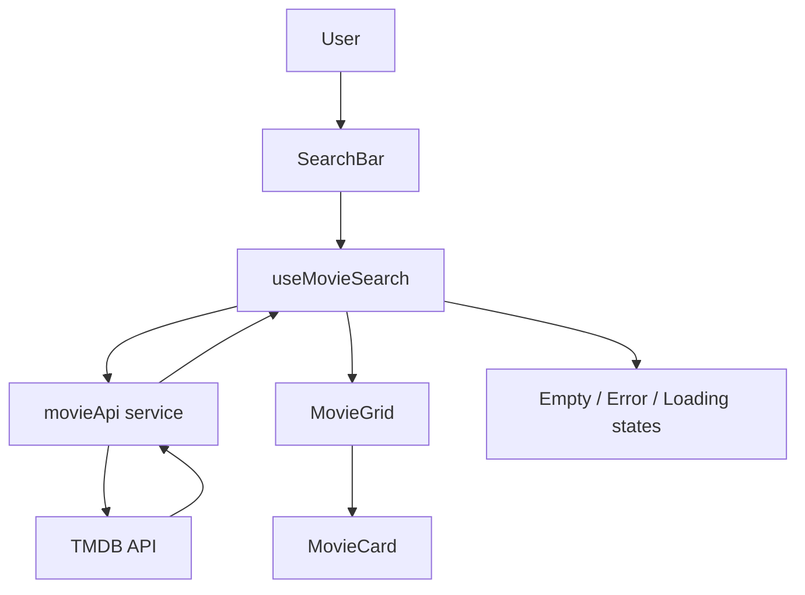
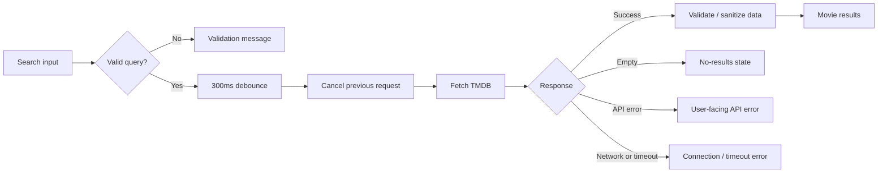
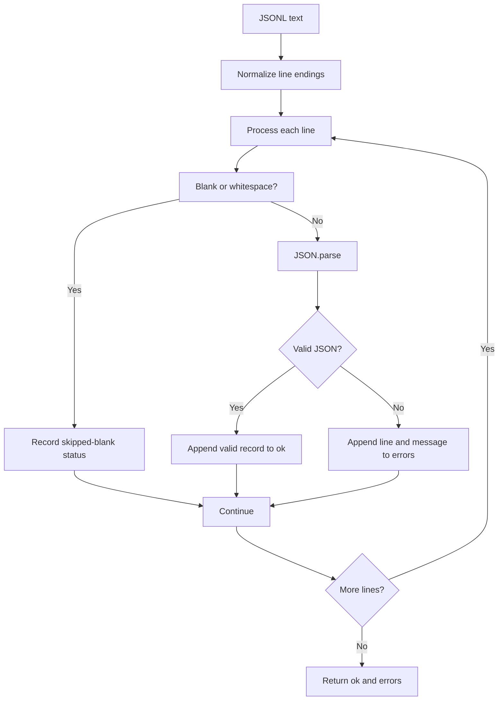

# Entrata AI Technical Coding Challenge

A submission for the **Entrata AI Technical Coding Challenge**, containing two independently scoped engineering tasks. The implementation follows an MVP-first, test-driven workflow with explicit AI-assisted analysis, iteration, debugging, and refinement.

## At a Glance

| Task | Focus | Stack | Verification |
|---|---|---|---|
| **Task 1 — Movie Discovery** | Search, API integration, state handling, responsive UI, resilient client behavior | React + TypeScript + Vite + Tailwind CSS | **30 tests passing** + production build |
| **Task 2 — JSONL Parser Bug** | Debugging, structured errors, resilience, edge cases | JavaScript + Node.js | **19 tests passing** |

Detailed task documentation:

- [`task-1-movie-discovery/README.md`](./task-1-movie-discovery/README.md)
- [`task-2-jsonl-parser/README.md`](./task-2-jsonl-parser/README.md)
- [`prompt.md`](./prompt.md) — AI prompts and documented iteration history

---

## Repository Structure

```text
Entrata-AI-Coding-Challenge/
├── README.md
├── prompt.md
├── .kiro/
│   └── specs/
│       └── movie-discovery-api/
│           ├── requirements.md
│           ├── design.md
│           ├── tasks.md
│           └── .config.kiro
├── task-1-movie-discovery/
│   ├── src/
│   │   ├── components/
│   │   ├── hooks/
│   │   ├── services/
│   │   ├── types/
│   │   └── utils/
│   ├── public/
│   ├── package.json
│   └── README.md
└── task-2-jsonl-parser/
    ├── src/
    │   ├── parser.js
    │   └── parser.test.js
    ├── demo.js
    ├── package.json
    └── README.md
```

---

# Task 1 — Movie Discovery API

## Objective

Build a responsive movie-discovery interface that searches The Movie Database (TMDB) API and presents useful movie information while handling loading, empty, error, timeout, cancellation, duplicate-request, and malformed-response states gracefully.

## Architecture



### Request and state flow



## Main Components

- **`SearchBar`** — validates input, supports button search, and performs 300 ms debounced search without duplicating the request when the button is clicked.
- **`useMovieSearch`** — coordinates search state, duplicate-query prevention, request cancellation, error handling, and lifecycle cleanup.
- **`movieApi`** — isolates TMDB communication, timeout handling, status-specific errors, runtime API-key validation, response validation, and malformed-record filtering.
- **`MovieGrid` / `MovieCard`** — render responsive movie results and safe fallback values.
- **`EmptyState`, `LoadingSpinner`, `ErrorMessage`** — make application states explicit to the user.
- **`types/movie.ts`** — keeps movie data and API error contracts explicit.
- **`utils/formatters.ts` / `genreMap.ts`** — keep presentation transformations separate from API logic.

## Implemented Behavior

- Movie title search
- Empty/whitespace query validation
- 300 ms debounced searching
- Manual Search-button submission
- Duplicate-query prevention
- Cancellation of an in-flight request when a new search begins
- 10-second request timeout using `AbortController`
- Distinction between intentional cancellation and timeout
- Loading, initial-empty, no-results, success, and error states
- HTTP-specific handling for common API failures
- Runtime API-key configuration validation
- Response-shape validation before consuming API data
- Filtering of malformed movie records
- Safe defaults for optional movie fields
- Poster fallback when an image is unavailable
- Release-year and one-decimal rating formatting
- Overview truncation
- Responsive movie-card grid
- Cleanup of timers and asynchronous requests
- Debug logging that does not print the API key

## Technology Stack

- **React 19 + TypeScript**
- **Vite**
- **Tailwind CSS**
- **Native Fetch API**
- **AbortController**
- **Vitest + React Testing Library**
- **ESLint**

## Running Task 1

```bash
cd task-1-movie-discovery
npm install
```

Create `.env.local` from `.env.example`:

```bash
VITE_TMDB_API_KEY=your_api_key_here
```

Then run:

```bash
npm run dev
```

Run the test suite:

```bash
npm test -- --run
```

Run linting:

```bash
npm run lint
```

Create a production build:

```bash
npm run build
```

### Verification

The final implementation was verified with **30 automated tests passing** and a successful production build.

## API Key Security

The challenge requires loading the TMDB credential from an environment variable. Because this implementation is intentionally frontend-only, a `VITE_*` variable is ultimately available to the browser bundle.

> **The API key is not secret once shipped to the client.**

This is documented as a challenge/MVP trade-off rather than production-grade secret storage. A production deployment should move the TMDB call behind a backend service:

```text
Browser → Application Backend → TMDB API
                         ↑
                  secret stored here
```

The repository contains `.env.example`; local `.env.local` files are excluded through `.gitignore`, and the application does not log the API key.

---

# Task 2 — JSON Lines Parser Bug

## Objective

Fix a JSON Lines parser that previously aborted at the first problematic line. The corrected implementation returns successful records and structured per-line errors without losing valid data.

## Parser Flow



## Original Failure Mode

The baseline implementation called `JSON.parse()` without per-line error handling. A blank or malformed line therefore caused an exception and prevented later lines from being processed.

The debugging workflow deliberately reproduced that failure, identified the root cause, and applied a minimal fix rather than introducing a new parser abstraction.

## Corrected Behavior

The final parser:

- Preserves valid records in `ok`.
- Continues processing after malformed JSON.
- Reports errors as `{ line, message }` using 1-based line numbers.
- Reports blank/whitespace-only lines without aborting.
- Treats trailing commas as invalid JSON rather than silently modifying input.
- Collects multiple errors instead of stopping at the first one.
- Preserves the order of valid records and errors.
- Supports LF, CRLF, CR, and mixed line endings.

### Output contract

```javascript
{
  ok: [...],
  errors: [
    { line: 3, message: "..." }
  ]
}
```

## Running Task 2

```bash
cd task-2-jsonl-parser
npm install
npm test
```

The repository also contains `demo.js` for a quick behavioral demonstration.

### Verification

The final implementation was verified with **19/19 tests passing**, including malformed input, blank lines, multiple errors, ordering, whitespace-only lines, and cross-platform line endings.

## Design Decisions

1. **Invalid JSON is reported, not repaired.** A trailing comma is treated as invalid JSON and recorded as an error.
2. **Blank lines are represented in the existing `errors` structure.** This keeps the public output contract unchanged while distinguishing them through the message `Skipped blank line`.
3. **Native `JSON.parse()` remains the validator.** No third-party JSON-repair dependency is required.
4. **Line endings are normalized.** This provides consistent LF, CRLF, CR, and mixed-line-ending behavior.
5. **The implementation remains intentionally small.** Streaming and advanced recovery could be added for very large files, but were outside the supplied MVP scope.

---

# Testing Summary

| Area | Result |
|---|---:|
| Task 1 automated tests | **30/30 passing** |
| Task 1 production build | **Passing** |
| Task 2 automated tests | **19/19 passing** |
| Task 2 malformed/blank/error cases | **Covered** |
| Task 2 line-ending cases | **Covered** |

The goal was not simply to make the happy path work, but to verify important failure modes and preserve correct data when individual operations fail.

---

# AI-Assisted Engineering Workflow

AI tools were used as engineering assistants throughout the challenge for requirement analysis, architecture discussion, implementation, debugging, testing, and iterative review.

The workflow was deliberately iterative rather than a single prompt followed by blind acceptance:

```text
Requirements
    ↓
AI-assisted analysis
    ↓
Design / trade-off review
    ↓
Incremental implementation
    ↓
Automated tests
    ↓
Failure / edge-case analysis
    ↓
Targeted refinement
    ↓
UI and robustness polish
    ↓
Final verification
```

For Task 2 specifically, the workflow included creating a minimal buggy baseline, reproducing the documented failure mode, analyzing ambiguous requirements, applying a minimal fix, and adding robustness tests for cross-platform line endings.

The prompts used during the challenge are preserved in [`prompt.md`](./prompt.md).

---

# Engineering Principles

- **MVP first:** implement required behavior before optional complexity.
- **Separation of concerns:** UI, API communication, state coordination, types, and formatting are separated in Task 1.
- **Minimal debugging changes:** Task 2 fixes the root cause without unnecessary abstractions.
- **Failure-aware design:** errors, timeouts, cancellation, empty results, malformed input, and lifecycle cleanup are explicitly considered.
- **Automated verification:** important behavior is backed by tests.
- **Security awareness:** the frontend API-key limitation is explicitly documented.
- **Transparent assumptions:** ambiguous behavior is documented where the supplied specification does not completely define it.
- **AI-assisted iteration:** AI output was reviewed, challenged, tested, and refined rather than accepted blindly.

---

# Known Limitations

### Task 1

- Frontend-only TMDB access means the API credential cannot be treated as a true secret in the deployed browser bundle.
- The MVP does not implement pagination.
- Genre mapping is static.
- Accessibility and keyboard-navigation enhancements could be expanded beyond the challenge MVP.

### Task 2

- The parser is memory-based rather than streaming.
- UTF-8 is assumed.
- Invalid JSON is reported rather than repaired.
- Extremely large JSONL files would benefit from a streaming implementation.

These are documented scope or production-hardening opportunities rather than hidden deficiencies.

---

# Final Verification Checklist

- [x] Task 1 implemented
- [x] Task 1 automated tests passing — **30/30**
- [x] Task 1 production build passing
- [x] Task 1 runtime/API error handling covered
- [x] Task 1 request cancellation and timeout handling covered
- [x] Task 1 malformed API-response handling covered
- [x] Task 2 debugging workflow completed
- [x] Task 2 automated tests passing — **19/19**
- [x] Task 2 edge cases and line endings covered
- [x] API credentials excluded from source control
- [x] Root `prompt.md` included
- [x] AI-assisted development process documented
- [x] Architecture and design decisions documented

---

## Submission

This repository contains the implementation, tests, documentation, Kiro specification artifacts, and AI prompt history required to review the completed challenge submission.
