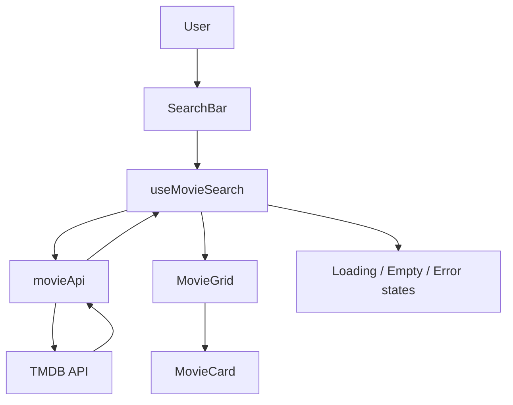
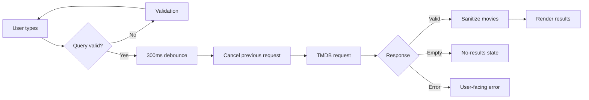

# Movie Discovery Application

A responsive React + TypeScript movie-search application using The Movie Database (TMDB) API, built as Task 1 of the Entrata AI Technical Coding Challenge.

## Features

- Search movies by title
- Search by button or 300 ms debounced input
- Duplicate-query prevention
- Request cancellation when a new search begins
- 10-second request timeout
- Distinguishes intentional cancellation from timeout failures
- Runtime API-key configuration validation
- Response-shape validation and malformed-record filtering
- Display poster, title, release year, rating, overview, and genres
- Safe fallbacks for missing movie fields/posters
- Loading, initial, empty, no-results, and error states
- HTTP-specific handling for common API failures
- Responsive 1/2/3-column movie grid
- Minimal debug logging without exposing the API key

## Architecture



### Responsibilities

- **`SearchBar`** — owns input state and validation, triggers manual searches, and manages the 300 ms debounce.
- **`useMovieSearch`** — owns search state, prevents duplicate queries, cancels in-flight requests, and handles lifecycle cleanup.
- **`movieApi`** — handles TMDB requests, timeout/cancellation, HTTP errors, API-key validation, response validation, and data sanitization.
- **`MovieGrid` / `MovieCard`** — render results and presentation fallbacks.
- **`EmptyState`, `LoadingSpinner`, `ErrorMessage`** — represent user-facing application states.
- **`types/movie.ts`** — defines movie and API-error contracts.
- **`utils/formatters.ts` / `genreMap.ts`** — isolate presentation formatting and genre mapping.

## Search Flow



## Technology Stack

- **React 19**
- **TypeScript 6**
- **Vite**
- **Tailwind CSS**
- **Native Fetch API**
- **AbortController**
- **Vitest**
- **React Testing Library**
- **ESLint**

The implementation intentionally uses native `fetch` instead of Axios to keep the dependency surface small while still supporting cancellation and timeout handling through `AbortController`.

## Setup

### 1. Install dependencies

```bash
npm install
```

### 2. Configure the TMDB API key

Create `.env.local` in this directory:

```bash
VITE_TMDB_API_KEY=your_api_key_here
```

`.env.local` is ignored by Git. `.env.example` is included as a safe configuration template.

### 3. Start the development server

```bash
npm run dev
```

### 4. Run tests

```bash
npm test -- --run
```

### 5. Run linting

```bash
npm run lint
```

### 6. Create a production build

```bash
npm run build
```

## Verification

The final implementation was verified with:

- **30/30 automated tests passing**
- Successful TypeScript/Vite production build
- API-service error and malformed-response coverage
- Search-state and cancellation coverage
- Component and user-interaction coverage

## Testing Scope

The tests cover high-value behavior rather than only the happy path, including:

- Successful TMDB search
- Empty results
- 401 authentication errors
- 404/429/5xx API errors
- Network failures
- Request timeout behavior
- Malformed API responses
- Malformed individual movie records
- Missing optional movie fields
- Invalid genre IDs
- HTTPS request construction
- Search validation
- Debounce/manual-search behavior
- Duplicate-query prevention
- Request cancellation
- Movie rendering and UI states

## API Key Security

This challenge implementation intentionally uses a frontend-only architecture, so a Vite `VITE_*` environment variable is ultimately bundled into browser-accessible JavaScript.

> **Important:** an environment variable prevents accidental hardcoding/source-control exposure, but it does **not** make a client-side API key secret after deployment.

For a production system, the architecture should be:

```text
Browser → Application Backend → TMDB API
                         ↑
                  secret stored here
```

The backend could additionally enforce authentication, rate limiting, caching, and server-side secret management.

The application validates that the key is configured at request time and does not print the key in debug logs.

## Error Handling

The API service distinguishes several failure categories:

| Failure | User-facing behavior |
|---|---|
| Missing API key | Configuration error |
| 401 | Invalid API-key error |
| 404 | No matching movies |
| 429 | Rate-limit message |
| 5xx | Server error message |
| Network failure | Connection error |
| 10-second timeout | Timeout message |
| Intentional cancellation | Silently ignored |
| Malformed response | Unexpected-response error |
| Malformed movie item | Item filtered out safely |

## UI States

The UI explicitly handles:

1. **Initial state** — prompts the user to search.
2. **Loading state** — indicates an active request.
3. **Success state** — displays movie cards.
4. **No-results state** — explains that no movies matched the query.
5. **Validation state** — prevents empty searches.
6. **API/network/timeout error state** — provides a useful failure message.

## Project Structure

```text
src/
├── components/
│   ├── SearchBar.tsx
│   ├── MovieCard.tsx
│   ├── MovieGrid.tsx
│   ├── LoadingSpinner.tsx
│   ├── ErrorMessage.tsx
│   └── EmptyState.tsx
├── hooks/
│   └── useMovieSearch.ts
├── services/
│   ├── movieApi.ts
│   └── movieApi.test.ts
├── types/
│   └── movie.ts
├── utils/
│   ├── formatters.ts
│   └── genreMap.ts
├── test/
│   └── setup.ts
├── App.tsx
├── index.css
└── main.tsx
```

## Design Decisions

### Native fetch + AbortController

A third-party HTTP client was unnecessary for this challenge. Native `fetch` provides the required request behavior, while `AbortController` supports both intentional cancellation and timeout cancellation.

### Debounce + explicit button search

The application supports both expected interaction styles. A 300 ms debounce provides convenient automatic searching, while the Search button gives users explicit control. The pending debounce is cancelled when the button is submitted, and duplicate-query protection prevents redundant API calls.

### Runtime API-key validation

The API key is checked when a search is requested rather than only during module initialization. This makes configuration failures explicit and easier to test.

### Response validation

External API data is treated as untrusted input. The service verifies the response shape, filters invalid movie entries, validates required fields, and supplies safe defaults for optional fields before data reaches the UI.

### Minimal logging

Debug logs are limited to meaningful request/search lifecycle events. The API key is never included in logs.

## Known Limitations

1. The client-side API key is not a true secret; a production application should use a backend proxy.
2. Pagination is not implemented because the challenge MVP focuses on the first result page.
3. Genre mapping is static.
4. Accessibility and keyboard-navigation enhancements could be expanded further.
5. No persistent client-side caching is implemented.

These are documented production-hardening opportunities rather than hidden behavior gaps in the challenge MVP.
