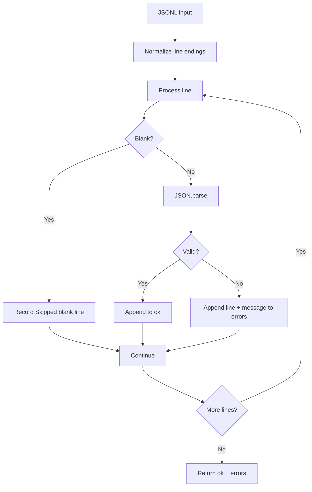

# Task 2: JSON Lines Parser Bug

A small JSON Lines (JSONL) parser whose original failure mode was reproduced, diagnosed, fixed, and then strengthened with regression tests.

## Problem

The parser processes newline-delimited JSON records and returns:

```javascript
{
  ok: [...],
  errors: [
    { line, message }
  ]
}
```

The original buggy behavior was that `JSON.parse()` could throw on a blank or malformed line and abort the entire operation. That caused valid records after the failing line to be lost and prevented collection of complete diagnostics.

## Fixed Behavior

The final parser:

1. Preserves every valid JSON record in `ok`.
2. Continues processing after malformed JSON.
3. Records malformed-input errors with 1-based line numbers.
4. Reports blank and whitespace-only lines as `Skipped blank line` without aborting.
5. Treats trailing commas as invalid JSON rather than silently repairing input.
6. Collects multiple errors in input order.
7. Preserves valid-record order.
8. Handles LF, CRLF, CR, and mixed line endings.
9. Keeps the public `{ ok, errors }` output contract unchanged.

## Parser Flow



## Implementation

The fix intentionally remains small. The core logic is:

```javascript
export function parseJSONL(input) {
  const lines = normalizeLineEndings(input).split('\n');
  const ok = [];
  const errors = [];

  for (let i = 0; i < lines.length; i++) {
    const line = lines[i];
    const lineNumber = i + 1;

    if (line.trim() === '') {
      errors.push({
        line: lineNumber,
        message: 'Skipped blank line'
      });
      continue;
    }

    try {
      ok.push(JSON.parse(line));
    } catch (error) {
      errors.push({
        line: lineNumber,
        message: error.message
      });
    }
  }

  return { ok, errors };
}
```

The exact implementation also normalizes common line endings before processing so platform-specific `\r` characters do not become part of JSON records.

## Example

Input:

```text
{"valid":1}

{bad}
{"valid":2}
{"trailing":3,}
```

Output shape:

```javascript
{
  ok: [
    { valid: 1 },
    { valid: 2 }
  ],
  errors: [
    { line: 2, message: 'Skipped blank line' },
    { line: 3, message: 'Expected property name...' },
    { line: 5, message: 'Expected double-quoted property name...' }
  ]
}
```

Exact `JSON.parse()` error wording may vary slightly by Node.js version; the parser preserves the native message rather than rewriting it.

## Testing

Run:

```bash
npm install
npm test
```

The final suite contains **19 meaningful regression tests**, all designed to verify parser recovery and edge-case behavior.

Coverage includes:

- valid JSONL
- blank lines
- whitespace-only lines
- malformed JSON
- malformed JSON in the middle of valid records
- trailing commas
- multiple errors
- preservation of valid records after errors
- consecutive malformed lines
- blank line followed by malformed JSON
- ordering of valid records
- ordering of errors
- empty input
- complex mixed input
- Windows CRLF line endings
- CRLF with blank lines
- CRLF with invalid JSON
- old-Mac CR line endings
- mixed line endings

## Design Decisions

### Blank lines

The supplied output contract contains only `ok` and `errors`. Rather than inventing another result field, skipped blank lines are represented in `errors` with the explicit message:

```text
Skipped blank line
```

This preserves the existing public structure while making the status distinguishable.

### Trailing commas

A trailing comma is not valid JSON. The parser therefore records the native `JSON.parse()` error and continues instead of silently modifying the input.

### Native JSON.parse

No JSON-repair dependency is used. Native `JSON.parse()` remains the validator, keeping behavior standards-based and easy to explain.

### Line endings

Input is normalized before line processing so LF, CRLF, CR, and mixed line endings produce consistent behavior and line numbering.

### Minimal fix

The debugging change deliberately avoids a parser rewrite. The essential behavior is implemented with blank-line handling, per-line error recovery, and line-ending normalization.

## Debugging Workflow

The AI-assisted debugging process was intentionally staged:

```text
Reproduce baseline bug
        ↓
Identify root cause
        ↓
Resolve ambiguous requirements
        ↓
Apply minimal fix
        ↓
Add focused regression tests
        ↓
Review cross-platform line endings
        ↓
Run complete test suite
```

This approach demonstrates the difference between generating a replacement implementation and using AI to investigate, reason about, and validate a targeted bug fix.

## Limitations

- Memory-based rather than streaming; very large JSONL files could benefit from streaming.
- UTF-8 text is assumed.
- Invalid JSON is reported rather than repaired.
- Native error-message wording can differ between Node.js versions.

## Verification

**Final result: 19/19 tests passing.**

The parser now completes the entire input, preserves valid data, and returns structured diagnostics for problematic lines instead of aborting at the first error.
